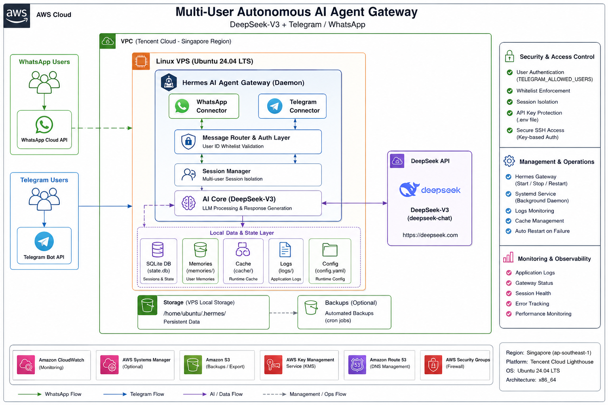

🤖 Autonomous AI Agent Gateway (DeepSeek + WhatsApp + Telegram)

A self-hosted AI assistant running on Tencent Cloud Ubuntu 24.04 LTS using the Hermes Agent Framework. The agent is connected to WhatsApp and Telegram, allowing multiple authorized users to interact with the same AI assistant while maintaining isolated conversation history.

This project demonstrates cloud deployment, Linux administration, AI integration, secure messaging platform configuration, and production-ready VPS hosting.

🚀 Features
🤖 DeepSeek LLM integration via API
💬 WhatsApp Bot integration
✈️ Telegram Bot integration
👥 Multi-user support with isolated chat sessions
🔐 User whitelist for Telegram access control
💾 Persistent conversation memory
⚡ Lightweight deployment (2 vCPU / 2 GB RAM)
☁️ Self-hosted on Tencent Cloud Ubuntu VPS
🔄 Long-running Hermes Gateway service

This project demonstrates practical experience in:

- Linux Administration
- Cloud Infrastructure
- AI Agent Deployment
- LLM Integration
- VPS Management
- Secure Remote Access (SSH)
- Multi-user Session Management
- Messaging Platform Integration
- Environment Configuration
- Production Deployment

📊 Architecture Diagram
```text
                                    +----------------------+
                                    |   WhatsApp Users     |
                                    +----------+-----------+
                                               |
                                               |
                                    +----------v-----------+
                                    | WhatsApp Cloud API   |
                                    +----------+-----------+
                                               |
                                               |
+-------------------+               +----------v-----------+              +--------------------+
| Telegram Users    +--------------->   Hermes AI Agent    +------------->  DeepSeek API       |
+-------------------+               | Ubuntu 24.04 LTS VPS |              | deepseek-chat      |
                                    | Tencent Cloud        |              +--------------------+
                                    +----------+-----------+
                                               |
                     +-------------------------+-------------------------+
                     |                         |                         |
                     |                         |                         |
             Conversation Memory         Session Storage           Runtime Cache
                 (memories/)               SQLite DB                Local Cache
                                               |
                                               |
                                       Configuration
                                   (.env + config.yaml)
```


☁️ Infrastructure

| Component           | Technology                     |
| ------------------- | ------------------------------ |
| Cloud Provider      | Tencent Cloud Lighthouse       |
| Operating System    | Ubuntu Server 24.04 LTS        |
| AI Framework        | Hermes Agent                   |
| Language Model      | DeepSeek API (`deepseek-chat`) |
| Messaging Platforms | WhatsApp, Telegram             |
| Database            | SQLite                         |
| Configuration       | YAML + Environment Variables   |
| Authentication      | Telegram User Whitelist        |
| Storage             | Local Persistent State         |


🔧 Environment Configuration

Create the Hermes configuration directory.

mkdir -p ~/.hermes
nano ~/.hermes/.env

Example:

DEEPSEEK_API_KEY=xxxxxxxx

OPENAI_API_BASE=https://api.deepseek.com
OPENAI_API_KEY=xxxxxxxx
LLM_MODEL=deepseek-chat

TELEGRAM_BOT_TOKEN=xxxxxxxx

TELEGRAM_ALLOWED_USERS=60123456789,6987654321

⚙️ Configure Hermes
hermes config set llm.provider deepseek

hermes config set llm.model deepseek-chat
▶️ Start Gateway
hermes gateway start

Stop the gateway

hermes gateway stop

Restart

hermes gateway restart

🎯 Skills Demonstrated
Cloud Infrastructure
Provisioned and configured a Tencent Cloud Lighthouse VPS
Ubuntu Server 24.04 LTS administration
Secure remote access using SSH
Linux filesystem and environment management
Cloud-based AI application hosting

Linux Administration
SSH authentication
Environment variable management
File permissions
Hidden directory management
Process management
Service troubleshooting
Terminal-based deployment

Artificial Intelligence
DeepSeek API integration
Large Language Model (LLM) configuration
AI agent deployment
Persistent conversation memory
Multi-user AI interaction
Prompt and personality configuration

Messaging Platform Integration
Telegram Bot integration
WhatsApp integration
Multi-platform AI gateway
Multi-user conversation routing

Security
API key isolation using environment variables
Telegram user whitelist
Session isolation between users
Authentication troubleshooting
Secure VPS deployment

Configuration Management
YAML configuration
Environment variables
Runtime configuration
Local state management
Persistent AI memory

Troubleshooting
SSH authentication
Linux networking
API configuration
Agent deployment
Gateway startup issues
Session persistence
📈 What I Learned

This project provided hands-on experience with:

Linux server administration
VPS deployment
AI API integration
Environment variable management
Telegram Bot configuration
WhatsApp integration
Persistent AI memory
Multi-user session management
Cloud infrastructure troubleshooting
SSH and remote server management
💡 Future Improvements
Docker deployment
Reverse Proxy (Nginx + SSL)
Automatic systemd service
OpenRouter support
Multiple AI model routing
Vector database memory
Voice message processing
Web dashboard


📚 Key Learning Outcomes

Through this project I gained practical experience in:

Deploying AI applications on a Linux cloud server
Configuring and managing Ubuntu 24.04 LTS
Integrating DeepSeek with Hermes Agent
Connecting AI services to WhatsApp and Telegram
Managing environment variables securely
Troubleshooting SSH authentication
Understanding persistent AI memory and session management
Operating AI services in a production-like VPS environment
Maintaining long-running AI gateway services
Building an end-to-end cloud-hosted AI assistant


👨‍💻 Author

M. Hafiz Shah

Systems Integration Engineer | Cloud & AI Enthusiast
